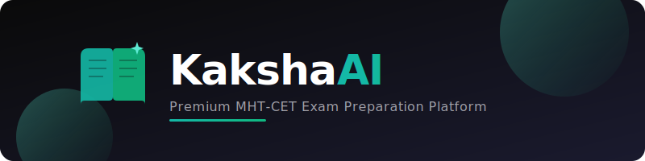

<p align="center">
  
</p>

<p align="center">
  
  
  
  
  
  
</p>

<p align="center">
  <strong>We help you crack what you are really aiming for.</strong><br/>
  AI-driven mock tests, deep analytics, curated study material & college cutoff intelligence — all in one place.
</p>

---

## Table of Contents

- [Overview](#overview)
- [Live Demo](#live-demo)
- [Features](#features)
- [Tech Stack](#tech-stack)
- [Database Schema](#database-schema)
- [Project Structure](#project-structure)
- [Getting Started](#getting-started)
- [Environment Variables](#environment-variables)
- [Deployment (Vercel)](#deployment-vercel)
- [Scripts](#scripts)
- [License](#license)

---

## Overview

**KakshaAI** is a full-featured MHT-CET (Maharashtra Common Entrance Test) exam preparation platform built with React and Supabase. It covers Physics, Chemistry, and Mathematics for Class 11 & 12 and offers adaptive mock tests, AI-powered doubt solving, a comprehensive study hub, detailed performance analytics, college cutoff analysis, and a gamified learning experience — all designed to help students maximize their entrance exam rank.

---

## Live Demo

> Deployed on **Vercel** — (http://kaksha-ai.vercel.app).

---

## Features

### Adaptive Mock Tests
- Full-length MHT-CET pattern exam simulation
- Section-wise timed tests with configurable difficulty (Easy / Medium / Hard)
- AI-powered proctoring with webcam monitoring and violation tracking
- Detailed post-test result analysis with correct/incorrect breakdowns
- Submission history with score tracking

### AI Study Assistant
- Powered by advanced **Google AI** models with automatic fallback
- Real-time streaming responses with Markdown & KaTeX math rendering
- Domain-specific assistance: doubt solving, study planning, college counseling
- Client-side rate limiting with automatic cooldown management
- Suggested prompts for guided learning

### Study Hub
- **71+ chapters** across Physics, Chemistry, and Mathematics
- Chapter-level notes (PDF) with download capability
- Curated YouTube video lectures per chapter with progress tracking
- Subject-specific formula books (Physics: 120 pages, Maths: 85, Chemistry: 95)
- Practice questions with explanations per chapter
- User-uploaded personal notes management

### Analytics Dashboard
- Subject-wise performance breakdown with accuracy & speed metrics
- Score progression charts over time
- Weekly activity trends & study time distribution
- MHT-CET score predictor
- Topic-wise accuracy analysis & error pattern identification
- Time management metrics
- Exportable PDF reports
- Filterable by time range (7d / 30d / 90d / 1yr)

### College Cutoff Intelligence
- **287,000+ admission records** across **71+ colleges**
- Multi-filter search: college, course, year, CAP round, category, level
- Rank predictor — find eligible colleges for your target rank
- Year-over-year cutoff trend analysis
- College comparison (side-by-side)
- Personal shortlist & saved searches

### Gamification & Engagement
- Daily personalized challenges (Question Blitz, Video Marathon, Perfect Practice, etc.)
- Study streak tracking with heatmap visualization
- Achievement badges & reward points system
- Real-time activity tracking & session logging

### Additional
- Dark / Light theme toggle
- Responsive design for all screen sizes
- Supabase Auth (email/password) with protected routes
- Animated splash screen & smooth page transitions (Framer Motion)
- Past papers viewer with PDF rendering

---

## Tech Stack

| Layer | Technology |
|-------|-----------|
| **Frontend** | React 18, React Router v6, Framer Motion, GSAP |
| **Styling** | Tailwind CSS 3.4, custom design tokens (Teal/Emerald brand) |
| **Build** | Vite 5.4 (SWC plugin) |
| **Backend** | Supabase (PostgreSQL, Auth, Storage, RLS) |
| **AI** | Google AI (Generative Language API) |
| **Charts** | Recharts |
| **Math** | KaTeX, remark-math, rehype-katex |
| **PDF** | pdfjs-dist, react-pdf, jsPDF |
| **Proctoring** | TensorFlow.js (COCO-SSD), MediaPipe Face Mesh |
| **Icons** | Lucide React |
| **OCR** | Tesseract.js |

---

## Database Schema

The Supabase PostgreSQL database uses **Row Level Security (RLS)** on all tables. Below is the entity relationship overview:

### Core Tables

| Table | Description | Key Relationships |
|-------|-------------|-------------------|
| `tests` | Mock test definitions (title, duration, difficulty, marks) | → `sections`, `submissions` |
| `sections` | Test sections with ordering & individual duration | → `tests`, `questions` |
| `questions` | MCQ questions with options (JSONB), correct answer, images | → `sections` |
| `submissions` | User test submissions with score & answers (JSONB) | → `tests`, `auth.users` |

### Study Hub Tables

| Table | Description | Key Relationships |
|-------|-------------|-------------------|
| `chapters` | Chapter catalog (subject, class, order, topic count) | → `chapter_videos`, `chapter_notes`, `practice_questions` |
| `chapter_videos` | YouTube video lectures linked to chapters | → `chapters`, `user_video_progress` |
| `chapter_notes` | Downloadable PDF notes per chapter | → `chapters` |
| `formula_books` | Subject-wise formula compilations | — |
| `practice_questions` | MCQ practice per chapter with explanations | → `chapters` |
| `user_notes` | User-uploaded personal notes | → `auth.users` |

### Progress & Analytics Tables

| Table | Description | Key Relationships |
|-------|-------------|-------------------|
| `user_chapter_progress` | Per-chapter completion metrics (videos, notes, practice) | → `auth.users`, `chapters` |
| `user_video_progress` | Video watch progress & resume position | → `auth.users`, `chapter_videos` |
| `user_practice_attempts` | Practice quiz attempt history | → `auth.users`, `chapters` |
| `user_paper_progress` | Past paper solving status & scores | → `auth.users`, `papers` |
| `user_stats` | Aggregated stats (streaks, accuracy, total study time, challenge points) | → `auth.users` |
| `daily_activity` | Daily engagement log (videos, chapters, tests, study time) | → `auth.users` |
| `study_sessions` | Session start/end tracking with pages visited | → `auth.users` |

### Gamification Tables

| Table | Description | Key Relationships |
|-------|-------------|-------------------|
| `daily_challenges` | Daily challenge definitions (type, target, reward points) | → `user_challenge_progress` |
| `user_challenge_progress` | User progress on each challenge | → `auth.users`, `daily_challenges` |
| `achievement_badges` | Badge definitions with unlock criteria (JSONB) | → `user_badges` |
| `user_badges` | Badges earned by users | → `auth.users`, `achievement_badges` |

### Other Tables

| Table | Description | Key Relationships |
|-------|-------------|-------------------|
| `papers` | Past exam papers (PDF files, metadata, tags) | → `user_paper_progress` |
| `cutoffs` | Historical college admission cutoff data (287K+ records) | — |
| `user_cutoff_preferences` | Saved cutoff filters & shortlists (JSONB) | → `auth.users` |
| `proctoring_sessions` | Proctoring session records (camera, mic, consent) | → `auth.users`, `proctoring_violations` |
| `proctoring_violations` | Detected violations with type, severity & confidence | → `proctoring_sessions`, `auth.users` |
| `study_reminders` | Configurable study reminders | → `auth.users` |

---

## Project Structure

```
kaksha-ai/
├── index.html                  # Entry HTML
├── package.json                # Dependencies & scripts
├── vite.config.js              # Vite configuration
├── tailwind.config.js          # Tailwind theme & design tokens
├── postcss.config.js           # PostCSS config
├── src/
│   ├── main.jsx                # React entry point
│   ├── App.jsx                 # Router & route definitions
│   ├── index.css               # Global styles
│   ├── assets/                 # Static assets
│   ├── components/
│   │   ├── layout/             # Header, Footer, Layout shell
│   │   ├── dashboard/          # Dashboard widgets
│   │   ├── analytics/          # Charts & analytics components
│   │   ├── studyhub/           # Study hub UI components
│   │   ├── chatbot/            # AI assistant chat UI
│   │   ├── cutoffs/            # College cutoff components
│   │   ├── proctoring/         # Proctoring overlay & checks
│   │   ├── ui/                 # Shared UI primitives
│   │   ├── ProtectedRoute.jsx  # Auth guard wrapper
│   │   └── SplashLoader.jsx    # Animated splash screen
│   ├── contexts/
│   │   └── ThemeContext.jsx    # Dark/Light theme provider
│   ├── lib/
│   │   ├── supabase.js         # Supabase client init
│   │   ├── chatbotService.js   # AI assistant integration
│   │   ├── studyHub.js         # Study hub data layer
│   │   ├── analyticsService.js # Analytics queries
│   │   ├── cutoffService.js    # Cutoff search/filter logic
│   │   ├── dashboard.js        # Dashboard data aggregation
│   │   ├── activityTracker.js  # Session & activity tracking
│   │   ├── challengeGenerator.js # Daily challenge logic
│   │   ├── userStatsService.js # User stats CRUD
│   │   └── proctoring/         # Proctoring detection modules
│   ├── pages/                  # Route-level page components
│   └── utils/                  # Utility helpers
└── scripts/                    # Data seeding & migration scripts
```

---

## Getting Started

### Prerequisites

- **Node.js** >= 18
- **npm** or **yarn**
- A **Supabase** project (with the schema tables created)

### Installation

```bash
# Clone the repository
git clone https://github.com/<your-username>/Kaksha_AI.git
cd Kaksha_AI

# Install dependencies
npm install

# Start development server
npm run dev
```

---
The app will be available at `http://kaksha-ai.vercel.app`.

## Environment Variables

Create a `.env` file in the project root with the following:

```env
VITE_SUPABASE_URL=https://your-project.supabase.co
VITE_SUPABASE_ANON_KEY=your-supabase-anon-key
VITE_GEMINI_API_KEY=your-google-ai-api-key
```

| Variable | Description |
|----------|-------------|
| `VITE_SUPABASE_URL` | Your Supabase project URL |
| `VITE_SUPABASE_ANON_KEY` | Supabase anonymous (public) API key |
| `VITE_GEMINI_API_KEY` | Google AI Studio API key |

> **Note:** Never commit `.env` to version control. It is already included in `.gitignore`.

---

## Deployment (Vercel)

### One-Click Deploy

1. Push the repository to GitHub
2. Go to [vercel.com](https://vercel.com) → **Add New Project**
3. Import the GitHub repository
4. Configure the build settings:

| Setting | Value |
|---------|-------|
| **Framework Preset** | Vite |
| **Build Command** | `npm run build` |
| **Output Directory** | `dist` |
| **Install Command** | `npm install` |

5. Add environment variables in **Settings → Environment Variables**:
   - `VITE_SUPABASE_URL`
   - `VITE_SUPABASE_ANON_KEY`
   - `VITE_GEMINI_API_KEY`

6. Click **Deploy**

### SPA Routing Fix

For client-side routing with React Router, create a `vercel.json` in the project root (if not already present):

```json
{
  "rewrites": [
    { "source": "/(.*)", "destination": "/index.html" }
  ]
}
```

---

## Scripts

| Command | Description |
|---------|-------------|
| `npm run dev` | Start Vite dev server |
| `npm run build` | Production build to `dist/` |
| `npm run preview` | Preview production build locally |
| `npm run lint` | Run ESLint |
| `npm run seed` | Seed test data to Supabase |

---

## License

This project is licensed under the [MIT License](LICENSE).

```
MIT License © 2026 jeetdarji
```
